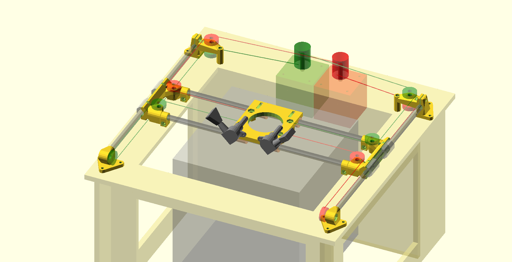

# corexy-printer

An attempt at designing a corexy printer that can (hopefully) be lasercut.

The printer at http://audiots.wordpress.com is beautiful, and has inspired me to create a more unique take on the coreXY reference implementation.

# Notes

* Grooved bearings for line idlers: http://www.ebay.com/itm/10-5-16-5mm-625VV-5mm-V-Groove-Guide-Pulley-Sealed-Rail-Ball-Bearing-5-16-5-/170998886188
* current design requires very tall pulleys.  Too tall, or use something like http://3d.grabercars.com/?product=filament-drive-reel-grooved-delrin-18mm-o-d-for-kossel ?
* Use M6 rod, LM6UU bearings for now, since I have some

