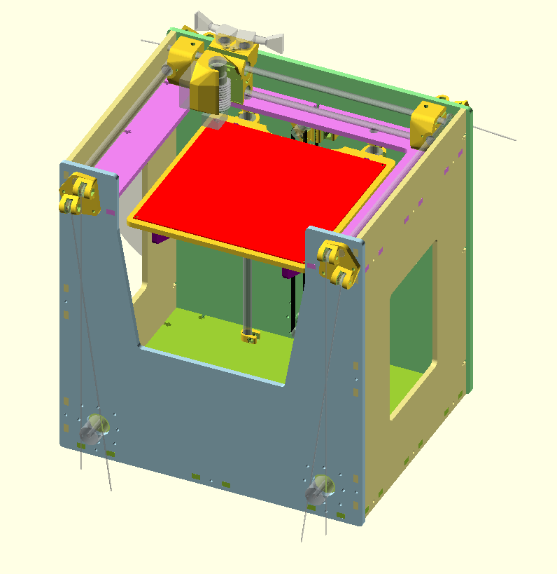

# corexy-printer

An attempt at a compact, flexible, parametric corexy printer design that can be almost entirely lasercut.

The printer at http://audiots.wordpress.com is beautiful and inspired me to create a more unique take on the coreXY reference implementation.
